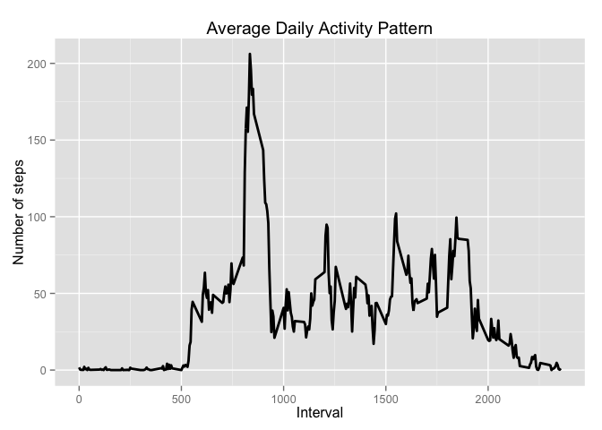
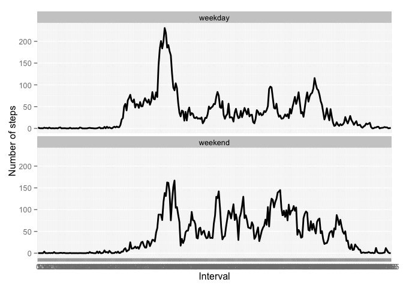

# Reproducible Research: Peer Assessment 1

Before beginning the assignment, I want to load the ggplot2 library since I know I'll be using it for this assignment.


```r
library(ggplot2) # I like to use ggplot2 for plotting rather than base or lattice
```

## Loading and preprocessing the data

Now, I'm loading the dataset into a dataframe called "data".  I've also chosen to preprocess some data.  I'm turning interval into a factor and putting date into a proper date format.


```r
setwd("~/coursera/ReproducibleResearch")
data <- read.csv(unz("repdata-data-activity.zip", "activity.csv"))
data$interval <- factor(data$interval)
data$date <- as.Date(data$date, format="%Y-%m-%d")
```

## What is mean total number of steps taken per day?

For this part of the assignment, we get to ignore the missing values in
the dataset.

1. Make a histogram of the total number of steps taken each day


```r
hist(tapply(data$steps, data$date, sum), xlab = "Total daily steps", breaks = 20, 
    main = "Total of steps taken per day") # I think a lot of people are going to make bar charts.  So, I used the hist function to make sure I got a histogram.
```

 

2. Calculate and report the **mean** and **median** total number of steps taken per day


```r
totaldailysteps <- as.numeric(tapply(data$steps, data$date, sum))
meansteps <- mean(totaldailysteps, na.rm = TRUE)
mediansteps <- median(totaldailysteps, na.rm = TRUE)
```

###The mean for the total number of steps is:


```r
meansteps
```

```
## [1] 10766
```

###The median for the total number of steps is:


```r
mediansteps
```

```
## [1] 10765
```

## What is the average daily activity pattern?


1. Make a time series plot (i.e. `type = "l"`) of the 5-minute interval (x-axis) and the average number of steps taken, averaged across all days (y-axis)


```r
        # aggregate is an easy way to get the average of steps taken across each 5-minute interval
stepsperinterval <- aggregate(data$steps, 
                                by = list(interval = data$interval),
                                FUN=mean, na.rm=TRUE)
        # convert to integers because you can't plot factors
stepsperinterval$interval <- 
        as.integer(levels(stepsperinterval$interval)[stepsperinterval$interval])
colnames(stepsperinterval) <- c("interval", "steps")
```


```r
        # time to plot the results of the aggregation
ggplot(stepsperinterval, aes(x=interval, y=steps)) +   
        geom_line(color="black", size=1) +  
        labs(title="Average Daily Activity Pattern", x="Interval", y="Number of steps") +  
        theme(legend.position = "bottom") + theme_grey()
```

 

2. Which 5-minute interval, on average across all the days in the dataset, contains the maximum number of steps?

### The 5-minute interval that contains the maximum number of steps is:


```r
maxstepsinterval <- stepsperinterval[which.max(  
        stepsperinterval$steps),]$interval
maxstepsinterval
```

```
## [1] 835
```

## Imputing missing values

1. Calculate and report the total number of missing values in the dataset (i.e. the total number of rows with `NA`s)

####The total number of missing values in the original dataset is:

```r
sum(is.na(data$steps))
```

```
## [1] 2304
```

2. Devise a strategy for filling in all of the missing values in the dataset. The strategy does not need to be sophisticated. For example, you could use the mean/median for that day, or the mean for that 5-minute interval, etc.


#### My strategy is to take the mean 5-minute interval values from the prior section to replace the NA values. 

3. Create a new dataset that is equal to the original dataset but with the missing data filled in.


```r
  stepvalues <- data.frame(data$steps)
  stepvalues[is.na(stepvalues),] <- ceiling(tapply(X=data$steps,INDEX=data$interval,FUN=mean,na.rm=TRUE))
  newdata <- cbind(stepvalues, data[,2:3])
  colnames(newdata) <- c("Steps", "Date", "Interval")
```


```r
  newstepsum <- aggregate(newdata$Steps, list(newdata$Date), sum)
  colnames(newstepsum) <- c("Date", "Steps")
```

4. Make a histogram of the total number of steps taken each day and Calculate and report the **mean** and **median** total number of steps taken per day. Do these values differ from the estimates from the first part of the assignment? What is the impact of imputing missing data on the estimates of the total daily number of steps?

####Here's a histogram from the new dataset

```r
hist(tapply(newstepsum$Steps, newstepsum$Date, sum), xlab = "Total daily steps", breaks = 20, 
    main = "Total of steps taken per day")
```

 


```r
        # calculate new mean and median
        newmeansteps <- mean(newstepsum$Steps)
        newmediansteps <- median(newstepsum$Steps)
```

####The mean of the new dataset is:

```
## [1] 10785
```

####The median of the new dataset is:

```
## [1] 10909
```

####My strategy did produce different results from the first part of the assignment. Both the mean and the median increased using this strategy.

####The mean went from 10766 to 10785
 
####The median went from  10765 to 10909
 
## Are there differences in activity patterns between weekdays and weekends?


```r
  daytype <- data.frame(sapply(X=newdata$Date, FUN=function(day) {
    if (weekdays(as.Date(day)) %in% c("Monday", "Tuesday", "Wednesday", "Thursday", "Friday")) {
      day <- "weekday"
    }
    else {
      day <- "weekend"
    } 
  }))
  
  newdatawithdaytype <- cbind(newdata, daytype)
  
  colnames(newdatawithdaytype) <- c("Steps", "Date", "Interval", "DayType")
```


```r
  weekendvsweekday <- aggregate(
      data=newdatawithdaytype,
      Steps ~ DayType + Interval,
      FUN=mean
  )
```

####As you can see from the plots below, there is a difference between weekday and weekend activity patterns.  The plots are skewed in a similar fashion but there are noticable significant differences in the two plots. 


```r
ggplot(weekendvsweekday , aes(x=Interval, y=Steps, group=DayType)) + 
        geom_line(color="black", size=1) + 
        labs(x="Interval", y="Number of steps") +
        theme_grey() +
        facet_wrap(~ DayType, nrow=2, ncol=1)
```

 
